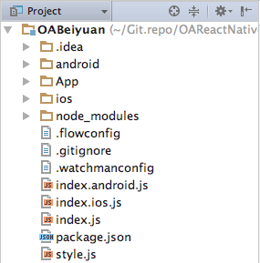
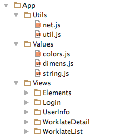
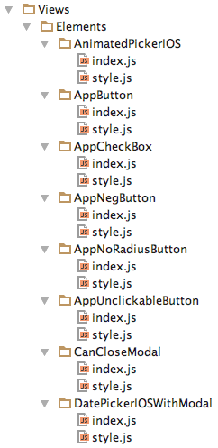

##OA项目结构与组件
###一、项目结构
  
####1.项目主目录包含以下几个重要文件与文件夹：  
######-文件夹  
**App**: 是项目JS部分的主文件夹，也是我们经常需要操作的文件夹。  
**android**: 是RN框架生成的Android整体项目，也包含自定义的为RN服务的定制控件。  
**ios**: 是RN框架生成的iOS整体项目，一般不需要操作或修改。  
**node_modules**: RN必要组件，以及使用npm安装的第三方组件。    
######-文件  
**index.js**: 程序的主入口文件。  
**style.js**: 程序的主入口的css风格文件。  
**index.ios.js**: 为了一套代码适配两种平台，此文件直接调用index.js  
**index.android.js**: 为了一套代码适配两种平台，此文件直接调用index.js  
####2.App主项目文件
  
**Utils**: 系统工具包  
|--*net.js*: 专门管理网络接口用的文件。  
|--*util.js*: 系统的一些通用方法，比如在App界面上打印相关信息。  
**Values**: 系统数值包  
|--*colors*: 专门存放系统中会用到的某些通用颜色。  
|--*dimens*: 专门存放系统中会用到的一些通用数值。  
|--*strings*: 专门存放系统中会用到的一些通用字符串。（方便将来做国际化）  
**Views**: 系统所有UI组件  
|--*Elements*: 自定义的UI小型控件。  
|--*其他*: 除Elements之外的其他都为各个大界面。  
###二、项目组件
项目组件分为三种
####1.node_modules目录下
node_modules下面的存放的是使用*** npm install ***命令来安装的开源第三方组件。
####2.android目录下
android下面有RN生成的android项目，除此之外还可以存放的android独立module组件，一般在代码中使用*NativeModules*来调用。
####3.App/Views/Elements目录下
一般我们使用JS编写的RN组件都放在这个目录下。每个组件单独建立一个文件夹，在需要的页面中调用此组件即可。  
